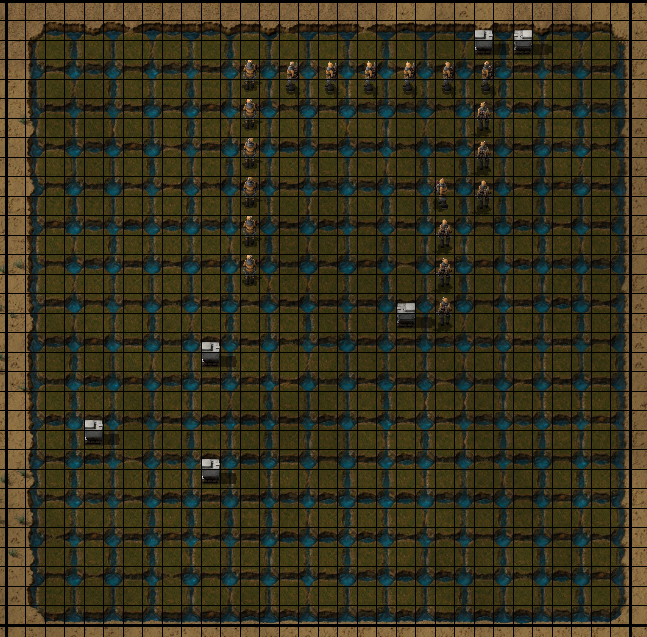

# Snaketorio

[]

## Instructions

Download mod from factrio mod portal <https://mods.factorio.com/mod/Snaketorio>

Run command to start game
```lua
/c
local surface = game.player.surface
local pos = game.player.position
pos = {x = math.floor(pos.x + 2), y = math.floor(pos.y + 2)}
local size = 15
local update_rate = 30
local max_food = 6
remote.call('snake', 'start_game', surface, pos, size, update_rate, max_food)
```

Click Snake button at top to join game.

To stop the game run
```lua
/c remote.call('snake', 'end_game')
```
